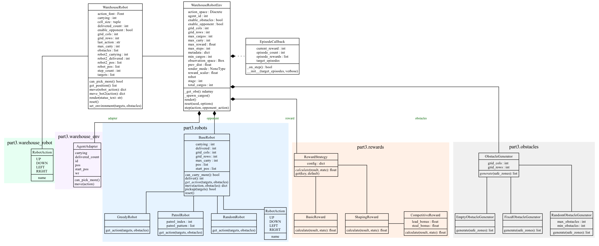

[](https://github.com/TWCkaijin/OOP-project/actions/workflows/AgentAutoTrainer.yml)
# OOP Project - Reinforcement Learning

This is a warehouse robot reinforcement learning project developed based on **Gymnasium** and **Stable-Baselines3**. The objective of this project is to train an intelligent agent capable of efficiently transporting cargo in a warehouse environment filled with obstacles, while competing or cooperating with an opponent (or other robots).

## Project Structure

This project is divided into three main parts, with the current core development focused on `src/part3`:

*   **`src/part1`**: Basic Reinforcement Learning algorithm implementations (e.g., Mountain Car).
*   **`src/part2`**: Advanced RL environment testing (e.g., Frozen Lake).
*   **`src/part3`**: **Core of the Warehouse Robot Project**.

### Part 3: Warehouse Robot Environment

The `src/part3` directory contains the custom warehouse environment, robot logic, reward mechanisms, and training scripts.

#### Core Module Descriptions

*   **`main.py`**:
    *   The entry point of the application.
    *   Handles parameter parsing and environment initialization.
    *   Manages the Training Loop and Evaluation processes.
    *   Includes `EpisodeCallback` for monitoring the training progress.

*   **`warehouse_env.py`**:
    *   Defines the `WarehouseRobotEnv` class (inheriting from `gym.Env`).
    *   Handles environment state updates, observation generation (`_get_obs`), and reward calculation calls.
    *   Includes the `AgentAdapter` class to unify the interface for operating Agent 0 and Agent 1.

*   **`warehouse_robot.py`**:
    *   Defines the `WarehouseRobot` class, responsible for low-level Pygame rendering and physics logic.
    *   Handles collision detection and movement animation effects.

*   **`robots.py`**:
    *   Defines behavior strategies for opponent robots.
    *   Includes `GreedyRobot` (Greedy Strategy), `PatrolRobot` (Patrol Strategy), and `RandomRobot` (Random Strategy).
    *   All robots inherit from `BaseRobot`.

*   **`rewards.py`**:
    *   Defines modular reward calculation strategies (`RewardStrategy`).
    *   Includes different calculation methods such as `BasicReward`, `ShapingReward`, and `CompetitiveReward`.

*   **`obstacles.py`**:
    *   Responsible for generating obstacles within the environment.
    *   Includes `FixedObstacleGenerator` and `RandomObstacleGenerator`.

## System Architecture (UML Class Diagram)

The diagram below illustrates the relationships, inheritance structures, and dependency directions between various classes in the system.

*   **Top Tier**: Shows the interaction between the Training Process (`EpisodeCallback`), Environment Core (`WarehouseRobotEnv`), and the Physical Robot Entity (`WarehouseRobot`).
*   **Middle Tier**: The `robots` module, defining different types of robot behaviors.
*   **Bottom Tier**: The `rewards` and `obstacles` modules, serving as supporting components for the environment.



## Installation & Usage

1.  **Install Dependencies**:
    ```bash
    uv sync
    ```

2.  **Training**:
    Train Agent 0 (Player 1)
    ```bash
    uv run src/part3/main.py --train --agent-id 0
    ```

3.  **Evaluation**:
    ```bash
    uv run src/part3/main.py --eval --agent-id 0 --render
    ```

4.  **Battle Mode**:
    ```bash
    uv run src/part3/main.py --battle
    ```
